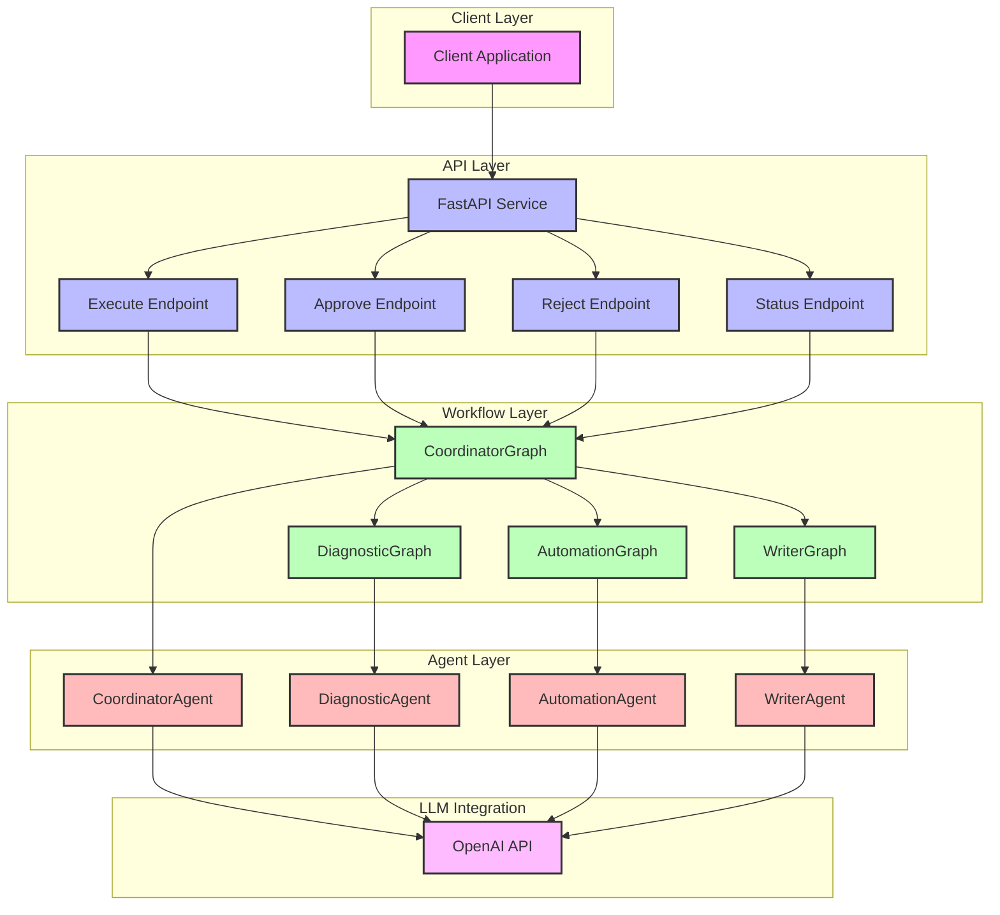
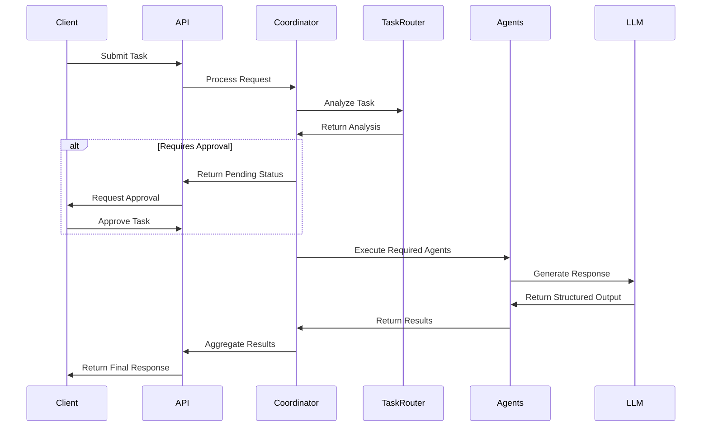

# System Architecture

## Component Descriptions

### Client Layer
- **Client Application**: External applications or users interacting with the API

### API Layer
- **FastAPI Service**: Main application server handling HTTP requests
- **Execute Endpoint**: Handles task execution requests
- **Approve Endpoint**: Processes plan approval requests
- **Reject Endpoint**: Handles plan rejection requests
- **Status Endpoint**: Provides task status information

### Workflow Layer
- **CoordinatorGraph**: Orchestrates the main workflow, delegating tasks to specialist graphs
- **DiagnosticGraph**: Handles problem analysis and diagnosis
- **AutomationGraph**: Manages script generation and automation
- **WriterGraph**: Handles content creation and documentation

### Agent Layer
- **CoordinatorAgent**: Manages task coordination and workflow decisions
- **DiagnosticAgent**: Analyzes problems and provides diagnoses
- **AutomationAgent**: Generates and validates automation scripts
- **WriterAgent**: Creates documentation and communication content

### LLM Integration
- **OpenAI API**: Provides AI capabilities to all agents

## Data Flow
1. Client sends request to FastAPI service
2. Request is processed by appropriate endpoint
3. CoordinatorGraph orchestrates the workflow
4. Specialist agents process their respective tasks
5. Results are aggregated and returned to client

## Key Features
- Modular architecture with clear separation of concerns
- Scalable agent-based system
- Flexible workflow orchestration
- Integrated LLM capabilities
- Comprehensive error handling
- Approval workflow support

## Overview

The IT Task Automation System is built using a microservices architecture with a focus on modularity, scalability, and maintainability. The system uses LLM-powered agents to handle various IT tasks through a coordinated workflow.

## System Components

### 1. API Layer
- **FastAPI Application**
  - RESTful endpoints for task management
  - Request validation and error handling
  - Authentication and authorization
  - Rate limiting and request throttling

### 2. Coordinator Layer
- **TaskRouter**
  - Task classification and analysis
  - Agent selection logic
  - Risk assessment
  - Complexity evaluation

- **Coordinator**
  - Task orchestration
  - State management
  - Error handling
  - Result aggregation

### 3. Agent Layer
- **DiagnosticAgent**
  - Issue analysis
  - Root cause identification
  - Solution generation
  - Confidence scoring

- **AutomationAgent**
  - Script generation
  - Syntax validation
  - Security checks
  - Execution verification

- **WriterAgent**
  - Documentation generation
  - Email drafting
  - Report formatting
  - Action item extraction

### 4. LLM Integration
- **OpenAI Integration**
  - GPT-3.5-turbo for task analysis
  - Structured output generation
  - Context management
  - Response validation

## Data Flow

## State Management

### Task States
1. **Pending Approval**
   - Initial analysis complete
   - Awaiting user approval
   - Risk assessment available

2. **In Progress**
   - Task approved
   - Agents executing
   - Partial results available

3. **Completed**
   - All agents finished
   - Results aggregated
   - Final output ready

4. **Failed**
   - Error occurred
   - Error details available
   - Recovery options provided

## Error Handling

### Error Types
1. **Validation Errors**
   - Invalid input
   - Missing required fields
   - Format issues

2. **Execution Errors**
   - Agent failures
   - LLM errors
   - Timeout issues

3. **System Errors**
   - Infrastructure issues
   - Resource constraints
   - Network problems

### Error Recovery
1. **Automatic Retry**
   - Configurable retry count
   - Exponential backoff
   - Error logging

2. **Manual Recovery**
   - Task restart
   - Partial execution
   - Error correction

## Security

### Authentication
- API key authentication
- Role-based access control
- Session management

### Authorization
- Task-level permissions
- Agent access control
- Resource restrictions

### Data Protection
- Input sanitization
- Output validation
- Secure storage

## Monitoring

### Metrics
- Task completion rate
- Agent performance
- Error rates
- Response times

### Logging
- Request logging
- Error tracking
- Performance monitoring
- Audit trails

## Scalability

### Horizontal Scaling
- Stateless design
- Load balancing
- Resource pooling

### Vertical Scaling
- Resource optimization
- Cache management
- Connection pooling

## Future Enhancements

### Planned Features
1. **Advanced Analytics**
   - Task pattern analysis
   - Performance optimization
   - Resource utilization

2. **Enhanced Security**
   - Advanced authentication
   - Encryption at rest
   - Secure communication

3. **Integration Capabilities**
   - External system integration
   - Webhook support
   - API extensions 